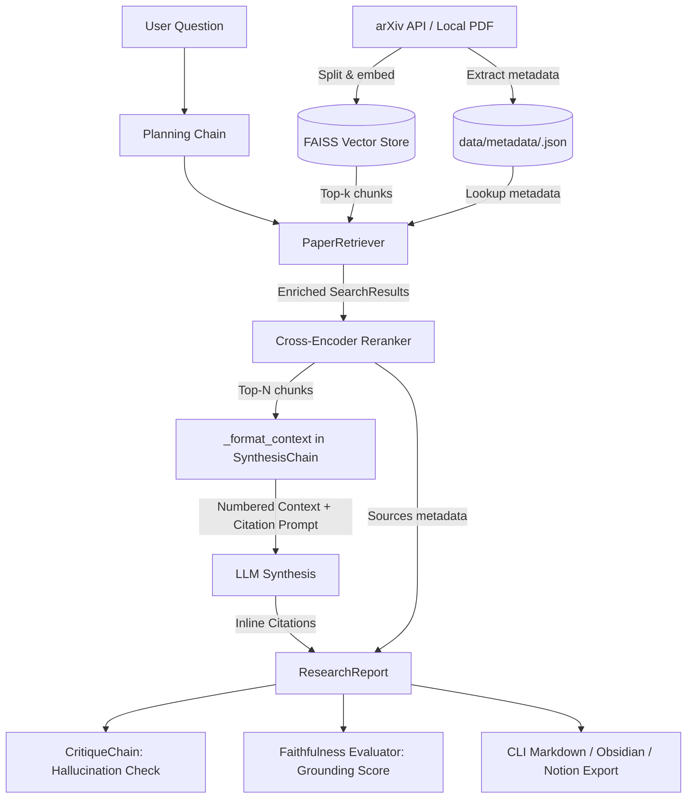

# Citation System & Grounding Architecture

This document provides a developer-level explanation of how citation, source tracking, and factual grounding work across PaperTrail.

---

## 1. Overview

In PaperTrail, citations are not an afterthought added to the text—they are maintained through an end-to-end provenance pipeline:
1. **Paper-level metadata** (authors, publication date, arXiv ID, title) is captured during ingestion.
2. **Retrieved text chunks** are dynamically enriched with paper metadata before generation.
3. **Structured context** is fed to the LLM with both numeric indices (`[1]`, `[2]`) and bibliographic strings (`Author et al. (YYYY)`).
4. **Inline citations** are generated by the LLM following strict prompt constraints.
5. **Critique & Faithfulness** pipelines evaluate whether generated claims match the cited excerpts.
6. **Sources sections** are formatted in CLI, Markdown exports, and note-taking integrations (e.g. Obsidian).

---

## 2. End-to-End Pipeline



---

## 3. Detailed Component Breakdown

### Step 1: Metadata Ingestion & Storage
- **Code:** `src/papertrail/ingestion/metadata.py`, `src/papertrail/schemas/schema.py`
- When papers are discovered via arXiv, an instance of `Paper` is created:
  ```python
  class Paper(BaseModel):
      arxiv_id: str
      title: str
      abstract: str
      authors: List[str]
      primary_category: str
      categories: List[str]
      published: datetime
      updated: datetime
      pdf_url: Optional[HttpUrl]
  ```
- Saved to disk as JSON: `data/metadata/{paper_id}.json`.
- Chunks stored in FAISS contain only `{ "paper_id": str, "chunk_id": int, "text": str }`.

### Step 2: Metadata Enrichment upon Retrieval
- **Code:** `src/papertrail/retrieval/retrievers.py` (`PaperRetriever.retrieve`)
- When querying the vector store, chunks alone lack author and publication details. `PaperRetriever` automatically joins chunks with their paper metadata:
  ```python
  paper = load_metadata(chunk["paper_id"])
  results.append(
      SearchResult(
          paper_id=chunk["paper_id"],
          chunk_id=chunk["chunk_id"],
          text=chunk["text"],
          score=score,
          title=paper.title if paper else None,
          authors=paper.authors if paper else None,
          published=str(paper.published.date()) if paper else None,
          abstract=paper.abstract if paper else None,
      )
  )
  ```
- Chunks are subsequently reranked via `papertrail.retrieval.reranker.rerank()`.

### Step 3: Context Formatting for the LLM
- **Code:** `src/papertrail/chains/synthesis.py` (`_format_context`)
- Before calling the LLM, chunks are converted into numbered references (`[1]`, `[2]`, ...):
  ```python
  def _format_context(results: List[SearchResult]) -> str:
      lines: List[str] = []
      for i, r in enumerate(results, 1):
          title = r.title or r.paper_id
          authors = ", ".join(r.authors[:3]) + " et al." if r.authors else ""
          published = f"({r.published})" if r.published else ""
          citation = f"{authors} {published}".strip()
          lines.append(f"[{i}] {title} – {citation}\n{r.text}\n")
      return "\n".join(lines)
  ```
- **Example formatted entry sent in the prompt context:**
  ```text
  [1] Conditioning LSTM Decoder and Bi-directional Attention Based Question Answering System – Liu et al. (2019)
  The final model with 2-layer Bi-LSTM and BiDAF achieves 73.97% F1 score...
  ```

### Step 4: Prompt Directives for Inline Citation
- **Code:** `src/papertrail/chains/synthesis.py` (`_SYNTHESIS_PROMPT`)
- The prompt instructs the LLM:
  ```text
  You are a research synthesis expert. Using ONLY the paper excerpts below, write a comprehensive answer to the research question.

  Your synthesis must:
  1. Directly answer the question with specific evidence from the excerpts.
  2. Cite papers inline as (Author et al., YEAR) or (arxiv:<id>) when available.
  3. Highlight consensus findings, disagreements, and open questions.
  4. Be factual – do NOT introduce information not present in the excerpts.
  5. Be structured: use short paragraphs or bullet points for readability.
  ```

#### Why You See Dual Citation Styles in Reports
Because the context header introduces both the numeric excerpt index `[i]` and `Author et al. (YYYY)`, frontier LLMs (such as GPT-4o or Claude 3.5) commonly use both:
1. **Academic inline style**: `evidence from Liu et al. (2019)`
2. **Provenance chunk style**: `(excerpts [3], [5])`, `(excerpt [1])`

This provides both readable prose and exact passage traceability back to the retrieved sources.

---

### Step 5: Factual Grounding & Critique

PaperTrail incorporates two validation mechanisms to ensure citations are real and statements are grounded:

1. **Critique Chain (`src/papertrail/chains/critique.py`)**:
   - Prompts the LLM as a peer reviewer with the synthesis and the source excerpts.
   - Specifically checks for:
     > "1. Claims in the synthesis NOT supported by the source excerpts (hallucinations)."
2. **Faithfulness Scorer (`src/papertrail/evaluation/faithfulness.py`)**:
   - Runs an LLM judge (`temperature=0.0`) or bigram token-overlap fallback to compute `faithfulness_score` in $[0.0, 1.0]$.
   - Displayed at the end of the report (e.g. `Faithfulness: 99.00%`).

---

### Step 6: Rendering Sources & Bibliographies

- **CLI / Markdown Output (`src/papertrail/cli.py`)**:
  Numbered sources correspond directly to the numbered excerpts fed to the synthesis chain:
  ```python
  sources_md = "\n".join(
      f"{i}. **{s.title or s.paper_id}** (score: {s.score:.3f})"
      for i, s in enumerate(rep.sources, 1)
  )
  ```
- **Obsidian Export (`src/papertrail/export/__init__.py`)**:
  Creates bidirectional wiki-links to paper notes:
  ```python
  for i, src in enumerate(report.sources, 1):
      content += f"{i}. [[{src.paper_id}]] – {src.title or 'Untitled'}\n"
  ```

---

## 4. Tracing a Real Example (`report.md`)

When running:
```bash
papertrail report "Recent progress in LSTM" --output report.md
```

| Output Section in `report.md` | Generation Mechanism | Code Origin |
|---|---|---|
| `Liu et al. (2019)` | Authors & date extracted from `data/metadata/<id>.json` | `retrievers.py` + `synthesis.py` |
| `(excerpts [3], [5])` | References index `[i]` from `_format_context` | `synthesis.py` (`_format_context`) |
| `## Sources` (items 1–6) | Ordered list of reranked `SearchResult` items | `cli.py` (`report` command) |
| `Faithfulness: 99.00%` | Evaluated against chunks 1–6 | `faithfulness.py` |

---

## 5. Developer Guide: Extending the Citation Engine

### 1. Enforce Exact IEEE-style or APA-style References
To force the LLM to use strictly numeric citations like `[1]` or APA style, adjust `_SYNTHESIS_PROMPT` in `src/papertrail/chains/synthesis.py`:
```diff
- 2. Cite papers inline as (Author et al., YEAR) or (arxiv:<id>) when available.
+ 2. Cite papers inline using bracketed numbers corresponding to the excerpt, e.g. [1], [2].
```

### 2. Add Hyperlinks to Sources
To make citations clickable directly to arXiv or local files in Markdown:
In `_format_context`:
```python
arxiv_url = f"https://arxiv.org/abs/{r.paper_id}"
lines.append(f"[{i}] [{title}]({arxiv_url}) – {citation}\n{r.text}\n")
```

### 3. Deduplicate Sources at the Paper Level
Currently, `rep.sources` contains chunk-level items. If multiple chunks originate from the same paper, the paper title may appear multiple times in `## Sources`.
To collapse chunks by `paper_id`:
```python
unique_papers = {}
for r in rep.sources:
    if r.paper_id not in unique_papers:
        unique_papers[r.paper_id] = r
```
